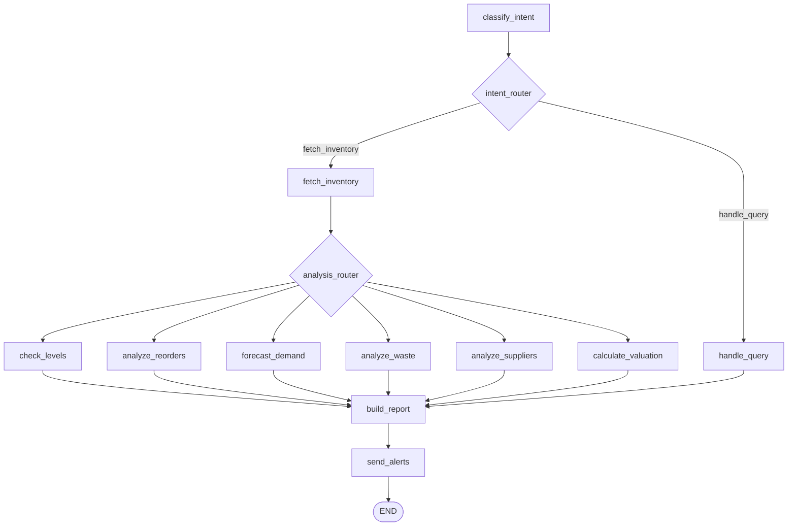

# Architecture

## The 1:1 mapping (Olympus → Google Agent Platform)

| Olympus (existing, private) | Google Agent Platform (the update for this hackathon) |
|---|---|
| Pantheon LangGraph-based multi-agent | **ADK** graph-based multi-agent |
| Multi-substrate runtime → Cloud Run | **Vertex AI Agent Runtime** (managed; long-running) |
| Ether conversation memory (tenant-scoped) | **Agent Memory Bank** (tenant-scoped) |
| Rex orchestrator ↔ Pantheon agent handoff | **A2A protocol** (optional in v1) |
| Ether T1–T6 cost-tier routing | **Gemini + Gemini Flash** as default model tiers (Ether still routes) |
| `olympus_sdk` Dart service surface | unchanged — the SDK calls the hosted agent the same way |

## Ceres workflow (what we ported)

Ceres is the Pantheon **inventory & supply-chain** agent. It serves restaurants, retail, healthcare, beauty, and other Olympus verticals. The agent classifies a natural-language inventory request, fetches data, runs one of six analyses, builds a report, and triggers alerts.

### LangGraph topology (the original)

11 nodes, 7 intents (`check_levels`, `reorder_analysis`, `demand_forecast`, `waste_analysis`, `supplier_analysis`, `valuation`, `generate_report`), TypedDict state with ~25 fields covering session context, classification, inventory data, analysis results, report, alerts/recommendations, and workflow tracking.

### ADK topology (the port)

The ADK manifest in [`adk/`](./adk/) preserves the exact node/state shape. Each LangGraph node becomes an ADK node; the routers become ADK conditional edges; the TypedDict state becomes the ADK session state schema. The behavior is identical — the difference is the runtime substrate.

### Why this port matters

- **Faithful, not rewrite** — judges can read the ADK manifest and the LangGraph source side-by-side and verify they encode the same workflow.
- **Multi-substrate runtime proof** — Olympus already runs Pantheon on Cloud Run + Cloud Functions + CF Workers + CF Containers. Adding Vertex AI Agent Runtime as a fourth substrate validates the platform's "any-runtime" thesis.
- **Ether stays in front of Gemini** — we route inference through the cost-tier router so the same agent serves a $5/mo tenant and a $5K/mo tenant on different model tiers. This is the **AI-native PaaS economic argument**.

## Tenant isolation

Agent Memory Bank is wired with one collection per `tenant_id`. The hackathon demo provisions two demo tenants and shows that tenant A cannot read tenant B's memory — this is the **multi-tenant isolation guarantee** every PaaS needs.

## What this repo intentionally hides

- The Ether router (tier catalog, model weights, classifier) — trade secret per our IP policy.
- The other 26 Pantheon agents.
- Production Spanner schema, IAM bindings, shared-services config.
- Customer data and production secrets.

The carve-out shows enough to reproduce the **Ceres on Vertex** demo. It does not ship the rest of the platform.
